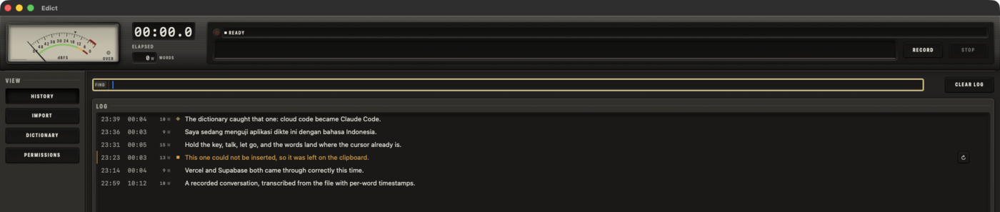
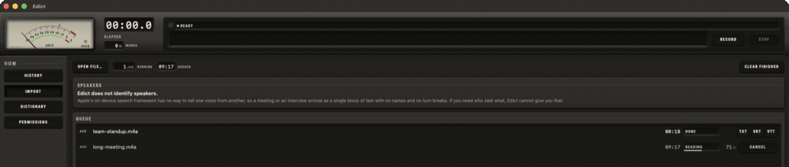

<div align="center">

# Edict

**Push-to-talk dictation for macOS. Hold a key, talk, and the words land where your cursor already is.**

Runs entirely on your machine. Nothing you say leaves the computer, there is no API to call,
and there is nothing to pay for.

[](https://www.apple.com/macos/)
[](https://swift.org)
[](Package.swift)
[](#how-it-stays-small)
[](Tests)
[](LICENSE)



</div>

---

## What it does

Hold **⌥** (Right Option), say something, let go. The text is inserted at your cursor in whatever
app has focus — editor, terminal, browser, chat.

Transcription is Apple's on-device `DictationTranscriber`, so there is no model to download, no
network round trip, and no subscription. **7 MB, zero third-party dependencies.**

| | |
|---|---|
| **Hold to talk** | ⌥ for English, **⇧⌥ for Indonesian** — the language is chosen per utterance, not by a mode you can forget you are in |
| **Text at your cursor** | A verified fallback ladder. Every insertion is *confirmed*, never assumed |
| **A dictionary you teach** | Two mechanisms at once: the engine is biased toward your terms, and a guaranteed correction pass runs afterwards |
| **File transcription** | Drop in audio or video — m4a, mp3, wav, aiff, caf, **mp4, mov**. Batch queue, per-word timestamps, TXT/SRT/VTT export |
| **Searchable history** | With the raw-versus-corrected diff, so you can see what the dictionary actually did |
| **54 languages** | Including Indonesian and Malay |
| **A real app** | Dock icon, app menu, resizable window, Settings on ⌘, and a menu-bar extra |

## Transcribing files

Drop a file on the window, press ⌘O, or open it from Finder. The audio track is pulled out of the
container, so a video costs nothing extra.



*A nine-minute recording, transcribed in about eight seconds.*

Measured on an M5 Pro: **9–27× realtime** warm, **75×** on a six-minute file, with **4.1% word error**
against the source script. Imports land in history with timestamps and never touch your cursor —
that is the line between dictating and transcribing.

## Clean it up afterwards, on-device

Dictation gives you what you said, filler and all. Any transcript can then be turned into clean prose,
a bullet list, or a one-sentence summary — **on this machine**, with Apple's on-device model. No API
key, no network, nothing leaving the computer.

    in   so um i think we should like move the meeting to thursday because uh mark
         is out on wednesday and we need him for the budget bit

    out  So I think we should move the meeting to Thursday because Mark is out on
         Wednesday and we need him for the budget bit.

Measured: clean-up 0.8–1.0 s, bullets ~1.0 s, summary ~0.8 s. It works in Indonesian too, which Apple
reports as an unsupported locale — so the result is captioned as carrying no guarantees rather than
quietly disabled.

The refined text always sits **beside** the transcript, never over it: the raw dictation is the record
of what was actually said. Refining before insertion is available as a setting, off by default, because
it adds a second or so to every dictation.

## The dictionary is the interesting part

Every dictation tool mangles proper nouns. Edict attacks that from two directions, because neither
alone is enough.

**Before transcription**, your terms are passed to the speech engine as contextual strings, so it
leans toward producing them. This genuinely works — `"Visa and soup base and anthropic"` became
`"Vercel and Supabase and Anthropic"`.

**After transcription**, a guaranteed pass rewrites what biasing missed. It is a single
left-to-right scan, earliest-then-longest across all rules, emitting into a buffer — so a rule can
never fire on another rule's output. It catches the forms these models glue together:

```
cloud code · cloud-code · cloud_code · CloudCode · Cloud Code   →   Claude Code
```

...while never touching `Cloudflare`, `clouds`, `iCloud`, or `CloudCodeBase`. There are 30 tests on
that behaviour alone, because it is the difference between a useful feature and one that quietly
corrupts your prose.

The history view shows when a rule fired and what it changed, so you can tell whether the dictionary
is earning its place.

## Install

Requires macOS 26 or later and Xcode 26+. No Xcode project, no Developer ID, no `sudo`.

```bash
git clone https://github.com/situmorang-com/edict.git
cd edict
./scripts/build-app.sh install     # → ~/Applications/Edict.app
```

The script bootstraps a **local self-signed identity** into its own keychain. That detail matters
more than it sounds: macOS keys Accessibility and Input Monitoring grants to the *code signature*,
and an ad-hoc signature's designated requirement is a bare `cdhash` — so your permissions would be
dropped on **every rebuild**. A stable certificate makes the requirement `identifier + certificate`,
and the grants survive.

> `swift run` is not a valid way to run this app: no bundle identifier, no `Info.plist`, and it lands
> in `.accessory` activation policy. Always go through the script.

### Permissions

Three, granted once, each explained in plain language in the app's own Permissions pane.

| Permission | Why |
|---|---|
| **Microphone** | To hear you. Prompted on first recording |
| **Input Monitoring** | To notice the hold-to-talk key while you are in another app |
| **Accessibility** | To read the focused text field, so it can confirm your words actually landed |

After granting Input Monitoring, press **RESTART** in the Permissions pane. This is not optional: a
`CGEventTap` created while permission was denied comes back **non-nil but permanently dead**, and no
amount of re-enabling revives it. The tap has to be rebuilt.

## Two languages, one key

Hold **⌥** for your primary language. Hold **⇧⌥** for your second.

The modifier is sampled at *arm* time, so either press order works. Either Shift counts. The
HUD shows which language is live while you speak — mid-utterance is the only moment a mis-registered
chord is free to redo.

Configure both in Settings (⌘,). The model for a new language downloads on first use, about 30
seconds. If it is missing, the first press says so rather than transcribing Indonesian with an
English model, which produces confident nonsense.

## Notable findings

Building this meant probing APIs that are new and thinly documented. Several results contradict what
the documentation implies, and all of them were established by compiling and running code rather
than by reading. The full set is in [`docs/RECON.md`](docs/RECON.md); these are the ones that changed
the design.

**`contextualStrings` is a no-op on `SpeechTranscriber`.** Measured byte-identical output across four
audio files and four configurations. It works on `DictationTranscriber` — which is why Edict uses
that module, and why the dictionary's biasing layer exists at all. The distinction is undocumented.

**Vocabulary biasing gets *worse* with more terms.** A 9-term list fixed proper nouns that a
200-term list did not, and analyzer setup grows from 6 ms to 577 ms. Hence the 50-term cap, and hence
the second correction pass behind it. Biasing is a nudge, not a promise.

**The Accessibility API reports success on writes it silently ignores.** Electron apps return
`kAXErrorSuccess` and do nothing. So every insertion is verified by reading back, and an app that
cannot be verified is demoted to paste-only and *remembered*. That turns a hardcoded blocklist into
something self-healing.

**Volatile results replace, finals append.** Naive concatenation produced 7,310 characters where 412
was correct — a 17.7× bloat.

**One analyzer per utterance, never reused.** `finalize` deadlocks forever while the input stream is
open, and `start()` on a finished analyzer silently no-ops, losing the utterance with no error.

**The two modules have different locale sets** — 45 versus 54. Indonesian exists only in
`DictationTranscriber`. Imports prefer `SpeechTranscriber` (4.2% word error at 66× realtime, against
10.1% at 15×) and fall back when the locale is uncovered.

## What it deliberately does not do

**Speaker identification.** Apple's Speech framework ships three modules — `SpeechTranscriber`,
`DictationTranscriber`, `SpeechDetector` — and none separates voices. A multi-person recording
arrives as one block of text with no names and no turn breaks. The app states this where you would
look for it rather than letting you find out on a meeting recording. Doing it properly needs Whisper
plus pyannote, which is gigabytes of weights against this app's 7 MB.

**Automatic language detection.** `DictationTranscriber` takes a fixed locale and has no
language-identification head. The only multilingual entry in the framework is `mul_IN`, on the module
that has no Indonesian. Hence the ⇧⌥ shortcut instead.

Both would fit behind the `TranscriptionEngine` seam in
[`Engine/Transcriber.swift`](Sources/EdictKit/Engine/Transcriber.swift), which exists for exactly
that reason.

## How it stays small

| | |
|---|---|
| Executable | 6.0 MB |
| Icon | 0.9 MB |
| **Total bundle** | **7.0 MB** |
| Embedded frameworks | **none** |

Every dependency resolves to `/System` — AppKit, SwiftUI, AVFoundation, Speech, CoreGraphics, IOKit.
The speech models are the OS's, shared by every app that asks, and managed by it.

For comparison: MacWhisper ships Whisper weights measured in gigabytes.

## Repo layout

```
Sources/EdictKit/
  App/       scene graph, app model, the dictation controller
  Engine/    hotkey tap, audio capture, speech, text injection, file import
  Data/      settings, dictionary, corrector, history, export
  Design/    tokens, components, VU meter, waveform
  Views/     main window, history, dictionary, import, settings, permissions
Sources/Edict/          thin launcher; calls EdictApp.main()
Tests/EdictKitTests/    185 tests in 17 suites
docs/                   RECON.md, CONTRACTS.md, design system
scripts/build-app.sh    swift build → signed, launchable .app
```

Everything real lives in the `EdictKit` library so the corrector, stores and exporters are unit
testable; the executable only calls `EdictApp.main()`.

## Design

The direction is a **1980s portable field recorder** — Sony TC-D5, Marantz PMD, Nakamichi, Braun.
Brushed aluminium and matte plastic, warm greys and cream, one red for the record lamp, amber and
green for level. Buttons that look pressed rather than tinted. The recording indicator is a VU meter
with a needle on a printed arc, not a progress bar.

It is defined as tokens before any view exists — colour, type, spacing, radius, border, shadow,
motion — and no view is permitted a one-off value. The needle's ballistics are the measured ANSI
C16.5 integration time, not an invented animation curve. See
[`docs/DESIGN-TOKENS.md`](docs/DESIGN-TOKENS.md) and
[`docs/DESIGN-COMPONENTS.md`](docs/DESIGN-COMPONENTS.md).

## Documentation

- [`docs/RECON.md`](docs/RECON.md) — empirical findings from probing these APIs
- [`docs/CONTRACTS.md`](docs/CONTRACTS.md) — interfaces, and the amendments that override them
- [`docs/DESIGN-TOKENS.md`](docs/DESIGN-TOKENS.md) · [`docs/DESIGN-COMPONENTS.md`](docs/DESIGN-COMPONENTS.md)

## Licence

MIT. See [LICENSE](LICENSE).
